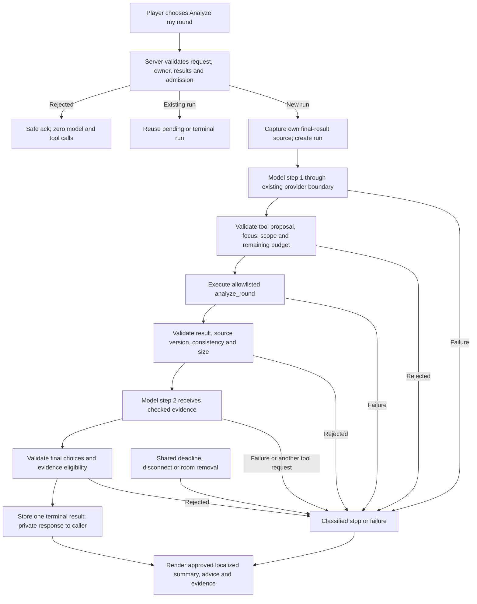

# W05 Agent Flow — post-round coach

**Status:** Runtime flow implemented as specified; see `src/server/features/coach-engine.ts`, `src/server/ai/coach-attempt-guard.ts` and the observed outcomes in [EVIDENCE_W05](EVIDENCE_W05.md). Remaining completion gates are listed there.
**Behavior owner:** [Spec](../specs/010-post-round-coach/spec.md).
**Contract owner:** [shared runtime schemas](../src/contracts/coach.schemas.ts); the canonical response shape remains indexed in [TOOL_CONTRACTS](TOOL_CONTRACTS.md).

## Architecture and success path

The orchestrator belongs on the backend. The browser owns presentation and the existing goal action only. Provider SDK/wire formats stay in existing adapters. The read-only analysis never re-enters `closeRound`, scoring or the answer checker.

## Explicit state

Run bookkeeping is separate from canonical game state and bounded by the completed room's lifetime:

- `runId`, server-bound owner and `roundId` (internal identifiers never go into model context).
- Fixed `goalId`, requested initial language, immutable `sourceVersion`.
- `status`: `created`, `running`, `completed`, `stopped`, `failed`.
- `phase`: `proposal`, `tool`, `final`, `terminal`.
- `stepCount`, `providerAttemptCount`, attempts in current step, recovery/fallback counts, `toolCallCount`.
- `startedAt`, immutable `deadlineAt`, and an abort signal for all active work.
- At most one normalized action key, one checked tool result and one validated final result.
- Bounded proposed/executed/rejected operation records and validation categories.
- One `stopReason`; terminal state cannot transition again.

Transitions: `created → running/proposal → running/tool → running/final → completed/terminal`. A nonterminal state may instead enter `stopped/terminal` or `failed/terminal` for the reasons below. There is no transition out of terminal status.

## Counters and limits

| Counter / bound | Exact rule |
| --- | --- |
| Model step | Increment once immediately before starting a new logical model decision, not for retries |
| Provider attempt | Atomically authorize and charge immediately before every real adapter call, including failures and fallback; never allow attempt 4 |
| Per-step attempts | At most 2; never reset the run-wide budget |
| Recovery | At most 1 additional attempt across both steps; same-model retry and fallback both consume it |
| Fallback | At most 1 switch to another allowlisted model/provider after a recoverable failure; keep the selected model for subsequent work unless this permitted recovery changes it |
| Tool execution | Increment only after full authorization/argument validation and immediately before invoking the tool; rejected proposal increments only the rejected-proposal log |
| Total deadline | `startedAt + 30,000 ms`, shared by steps, retries, waits, tool work and validation |
| Attempt timeout | `min(8,000 ms, deadlineAt - now)` |
| Tool timeout | `min(250 ms, deadlineAt - now)`; bounded pure calculation, no external calls |
| Tool bytes | At most 16,384 UTF-8 bytes before entering model context |
| Backoff | Existing transient-error policy; honor Retry-After only if the wait and next attempt fit remaining time; no new attempt after the deadline |

The existing gateway's per-interaction budget is insufficient by itself. Planning must provide an additive W05 run deadline/attempt guard inside the actual attempt boundary, so hidden retries cannot overspend. Legacy W04 callers preserve their defaults and behavior.

Before each operation and after each asynchronous result, check terminal status, source validity, deadline and caller/room lifecycle. Use the injected clock/scheduler for deterministic tests. A timer independently closes the run if a dependency hangs; abort alone is not sufficient. No synchronous computation may use an unbounded input or loop.

## Repetition and second-step proposals

The canonical action key is `toolName + normalizedArguments + sourceVersion`. A valid repeated request with the same key yields `repeated_action`; a different valid analysis request in the final phase yields `tool_call_limit`. Unknown names/invalid arguments keep their specific rejection reasons. All of these execute zero additional tools. The fixed engine has no third-decision transition, so there is no hypothetical third provider call; `step_limit` is retained only as a reserved closed stop code.

## Failure policy and terminal reasons

| Category | Status / reason | Recovery |
| --- | --- | --- |
| Invalid initial request, foreign caller, wrong phase, stale round | No new run; existing game ack code | None; zero provider/tool calls |
| Early final, bad JSON/schema/proposal | stopped / `invalid_model_proposal` | None |
| Unknown tool / invalid arguments | stopped / `unknown_tool` / `invalid_tool_arguments` | None; zero tool executions |
| Invalid/oversized/stale analysis result | stopped / `invalid_tool_result` | None; no step 2 |
| Tool throws / tool timeout | failed / `tool_failed` / `tool_timeout` | None |
| Provider auth/config after admission | failed / `provider_failed` | No blind retry |
| No provider configured at preflight | No new run; `AI_UNAVAILABLE` ack | None; zero provider/tool calls |
| Transient transport/5xx/429/attempt timeout | failed / `provider_failed`, `rate_limit`, `provider_timeout` when recovery fails | One permitted recovery only if all budgets allow |
| Daily budget or provider quota exhausted | stopped / `quota_exhausted` | No budget bypass; one allowed fallback only for provider quota, not app daily-budget exhaustion |
| Refusal | stopped / `provider_refusal` | None |
| Unsupported final choices/references | stopped / `invalid_final` | None; no partial prose |
| Missing usable evidence | stopped / `insufficient_evidence` | None |
| Repetition / tool / attempt bound | stopped / `repeated_action`, `tool_call_limit`, `provider_attempt_limit`; two-call topology has no third transition (`step_limit` reserved) | None |
| Run deadline | stopped / `deadline` | Abort and discard late output |
| Owner disconnect / room removal / leave | stopped / `cancelled` | Abort; exactly-once terminal state |
| Fully validated review | completed / `completed` | No further work |

Browser messages map these reasons to approved SR/EN text; internal provider diagnostics and stack traces stay private. Admission errors reuse the existing closed game-error registry. Run reasons are a separate proposed closed schema; no ad-hoc new game error is introduced.

## Duplicate requests and lifecycle

The key is the server-bound human seat plus current completed round. Atomically establish one run before awaiting model work. Concurrent duplicate callbacks attach to the existing work or return its cached terminal view. They do not recharge admission or attempt counts. No automatic rerun after a terminal failure.

The proposed transport is one request/terminal-ack operation; the UI shows loading while awaiting the ack. No progress broadcast or additional cancel event is required. Leaving results uses the existing disconnect path and cancels the run. Room cleanup cancels remaining runs and removes snapshot/run/cache data. Stale responses cannot update a new screen or new round.

## Safe observability

Record run ID, step, attempt number, provider/model, attempt kind, elapsed time, tool proposed/executed/rejected, validation category, terminal status/reason and available token counts. A structured fact/reference trace with synthetic fixtures is sufficient for evidence; no chain-of-thought, prompts, raw replies, names, addresses or answers are recorded. Counters are bounded; observed examples are added to [EVIDENCE_W05](EVIDENCE_W05.md) only after execution.
